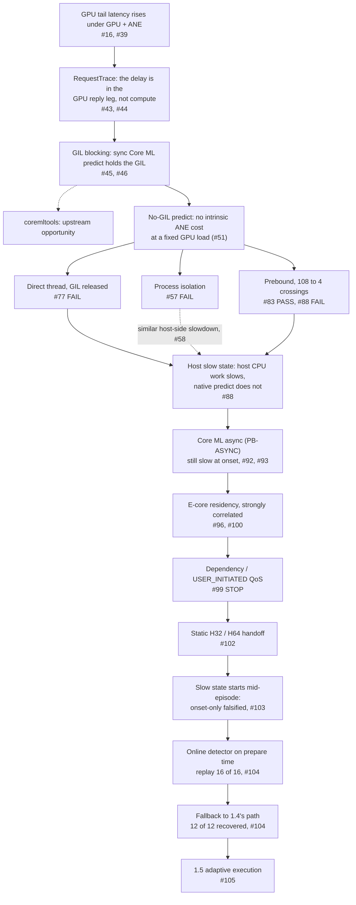

# Research: Adaptive Heterogeneous Inference on Apple Silicon

This is an index. It adds no measurement and changes no verdict. Every number below is copied from
the study it links to, and that study's own README, tables and raw data are the record.

## Overview

laya-apple serves one model on two devices of one Mac at the same time: long requests on the MLX
GPU, short ones on the Apple Neural Engine (ANE) through Core ML. Between 1.4 and 1.5, one line of
research asked why GPU tail latency rises when the two run together, and what the runtime can do
about it.

The line moved in this order:
1. It localized the delay to the GPU completion path, not GPU compute.
2. It showed by intervention that Core ML's synchronous `predict` holding the GIL causes it.
3. It removed the GIL wait in several ways: a worker process, a GIL-released binding, a prebound
   binding and Core ML's official async API. Each removed the wait. Each then failed, or could not
   be made safe, on the product mix.
4. The GIL-free thread paths failed on a shared host-side slow state: host CPU work slowed while
   the native Core ML call did not. That state was later found to be strongly correlated with the
   runtime's threads running on the Efficiency cores.
5. A QoS intervention did not move the threads, and a static request-count handoff avoided the
   slow state at onset but not later.
6. 1.5 therefore does not try to prevent the slow state. It detects it from the runtime's own
   request trace and falls back to the 1.4 path for the rest of the episode.

The research code lives in this directory. The `laya_apple` package never imports it.

Machine for every study below: one Mac Studio with an M4 Max. macOS, Python, coremltools, MLX and
PyObjC versions are recorded per study. The configuration names are used throughout:
- **A:** production 1.4. ANE on a thread in the caller's process, coremltools `predict`, GIL held.
- **B:** ANE in a worker process, where the study names it so. In #57 this is simply "process".
- **C:** ANE on a thread, PyObjC `predict` with the GIL released (#46's binding).
- **PB:** prebound binding, one prediction crossing per forward (#83).
- **PB-ASYNC:** PB through Core ML's asynchronous prediction API (#92). 1.5's fast path.

## Research journey

The dotted branch is not work in this repository. #46's finding is that coremltools'
`CompiledMLModel.predict` holds the GIL for the whole native call. That could become an upstream
coremltools contribution. No upstream issue or pull request exists yet.

## Research map

Evidence kinds:
- **observation:** measurement without a manipulated cause;
- **intervention:** one factor changed, everything else fixed;
- **gate:** preregistered criteria applied as written;
- **post-hoc:** analysis of existing data, outside any gate;
- **production:** the shipped runtime under a preregistered validation.

| # | Question | Evidence | Finding | Consequence |
|---|---|---|---|---|
| 1 | Are the GPU and the ANE fully isolated? | [#16], [#39]; [`gpu-ane-interference/`](gpu-ane-interference/README.md). Observation. | No. With the ANE on a thread, GPU service time rises ×1.04–1.64 (typed-decisions) while the ANE is barely affected (≤×1.024). With the ANE in a process, both pay, and CPU time for the same work rises 2–4×. | The levers are in execution (the GIL, CPU performance state), not routing. A contention-aware router prototype failed its prewritten criteria. |
| 2 | Is GPU compute itself slower? | [#39]; [#43], [#44] (issue #6); [`gpu-ane-interference/ledger/`](gpu-ane-interference/ledger/README.md). Observation. | Barely. MLX `mx.eval` time rises by at most ×1.04 in 15 of 16 GPU streams (#39), ×1.066 in the ledger re-run. The runtime's `RequestTrace` ([#43]) puts the delay in the GPU reply leg, aligned with the end of the ANE's `predict`: return leg 0.05 → 7.41 ms, 91.1% of the occupancy increase ([#44]). The timestamps do not observe the GIL itself. | Target the completion path ([#45]). |
| 3 | Is the GIL held by synchronous Core ML `predict` the cause? | [#45], [#46]; [`coreml-gil-completion-path/`](coreml-gil-completion-path/README.md). Intervention (2×2). | Yes. The GPU dispatcher has read the reply and waits in `take_gil`. Holding the GIL without Core ML reproduces the delay; the same `predict` with the GIL released removes it. GPU return P50 **7.67 → 0.14 ms**. | A GIL-released binding (C) becomes the candidate. |
| 4 | Does releasing the GIL cost the ANE? | [#46], then [#51]; [`coreml-placement-deconfounding/`](coreml-placement-deconfounding/README.md). Intervention at a fixed GPU offered load. | #46 measured −13.5% ANE throughput, but its closed-loop GPU ran 44% more requests once unblocked. At an identical GPU arrival trace (46.65 req/s): C +0.1% ANE throughput, e2e P99 ×0.99; process +0.5%. | No measurable intrinsic ANE cost at that load. The higher-load comparison was not re-tested. |
| 5 | Is process isolation production-safe? | [#52], [#54], [#56], [#57]; [`benchmarks/ane-process-isolation/`](../benchmarks/ane-process-isolation/README.md). Gate. | **FAIL** on both models. laya short P99 +17.5% (limit +5%); typed-decisions aggregate −16.1% and short P99 +73.3%. It does remove the GPU wait: laya return P50 4.283 → 0.031 ms. The earlier resource gate ([#54]) also recorded FAIL. | laya and typed-decisions stay on a thread. |
| 6 | Would pacing the GPU recover the process-placed ANE tail? | [#58] (issue only). Post-hoc on #57 and #39 data, preregistered stop rule. | The precondition failed for typed-decisions: thread placement gives no useful accidental GPU backpressure (`mx.eval` busy 0.875 against 0.877). The added short time is mostly host-side: `predict` accounts for about 30%; CPU per short request rises 0.58 → 2.86 ms. | Pacing not run. The host-side CPU slowdown is recorded as unexplained. |
| 7 | Does a thread with the GIL released pass the product mix? | [#66], [#67], [#77]; [`coreml-nogil-product-mix/`](coreml-nogil-product-mix/README.md). Gate. | **FAIL** on all three models. C: laya short P99 +12.9%; typed-decisions aggregate −7.2% and short P99 +83.0%. GPU completion isolation passes everywhere (4.35 / 8.53 → 0.05–0.06 ms). | The cost moves to the ANE short stream. Production stays A. |
| 8 | Does collapsing Python↔ObjC crossings fix it? | [#80], [#81], [#82], [#83]; [`coreml-prebind-predict/`](coreml-prebind-predict/README.md). Gate. | Crossings per forward: C 108 (plus 62 re-entries), PB 4. PB **PASS** on laya and typed-decisions, INCONCLUSIVE on multilingual, under a hetero-only protocol. But C, #77's FAIL, also passed under that protocol. | The pass cannot be attributed to fewer crossings. Replicate under the full protocol. |
| 9 | Does PB replicate under the full protocol? | [#86], [#87], [#88]; [`coreml-prebind-full-protocol/`](coreml-prebind-full-protocol/README.md). Gate with a sequential stop rule. | **FAIL**, futility stop at n = 12: laya PB short P99 1.409× [1.223, 1.623] against A. C's #77 failure reproduces. Observation: hetero windows fall into two states, normal 10.4–12.3 ms or slow 13.6–21.2 ms (laya PB 11 of 12 slow). The slow state inflates host CPU work (GPU-thread CPU per forward 6.1 against 1.8 ms), while native `predict` is unchanged (9.67 against 9.62 ms). | The hetero-only PASS does not carry over. The host slow state becomes the question ([#89]). |
| 10 | Does Core ML's official async API remove the slow state? | [#90], [#91], [#92]; [`coreml-async-predict/`](coreml-async-predict/README.md). Gate (screen). | No. Hetero windows slow: A 0 of 3, PB-SYNC 3 of 3, PB-ASYNC 2 of 3. PB-ASYNC does keep GPU return P50 at 0.035 ms and throughput at or above A. | Async is not claimed to fix anything; round 2 not run. PB-ASYNC stays the candidate fast path. |
| 11 | What is the slow state's time structure? | [#93]; [`tail_decomposition.md`](coreml-async-predict/tail_decomposition.md). Post-hoc on #92 data. | For PB-ASYNC, an episode at the start of each hetero window: requests with `prepare` > 0.3 ms for 0.8–3.4 s, then normal (A: at most about 0.3 s here, 0.5 s under #96's rule; PB-SYNC: almost the whole window). Outside the episodes PB-ASYNC's P99 is 10.4 ms against A's 11.9 ms. | Treat it as an onset transient; look for its cause. |
| 12 | How does the slow state relate to E-core residency? | [#94], [#95], [#96]; [`coreml-async-transient/`](coreml-async-transient/README.md). Gate readings on CPU counters (observation). | Reading C. In PB-ASYNC's transient buckets, the ANE dispatcher, client-short and Core ML callback threads run with E share 0.91–1.00, against 0.00 in steady state (per-transition exceptions are in its `tables.md`); the transient ends when they move back to P. The study states it does not show why the scheduler placed them there. | **Strong correlation, not a scheduler cause.** Test a scheduling intervention. |
| 13 | Does USER_INITIATED or dependency QoS move the threads? | [#97], [#98], [#99]; [`coreml-dependency-qos/`](coreml-dependency-qos/README.md). Intervention, gate. | No. Both manipulations took effect (verified overrides, QoS read back as 0x19), yet neither moved the ANE dispatcher off the E cores in any transition (E share 0.70–1.00). | **STOP** the QoS route; no further QoS variants. |
| 14 | Is the residency confined to one thread or process? | [#100]; [`placement_posthoc.md`](coreml-dependency-qos/placement_posthoc.md). Post-hoc on #99 data. | No. The ANE chain, the parent's other threads and the GPU worker process are E-dominant together in all 6 transitions (class P3, rule fixed before the output was read); single-device windows stay on P (E share ≤ 0.04). Only the two laya processes were sampled. | Per-thread or per-process placement fixes are ruled out. |
| 15 | Is a static H32 / H64 request-count handoff safe? | [#101], [#102]; [`coreml-staged-handoff/`](coreml-staged-handoff/README.md). Gate (screen, then a separate confirmation). | Not replicated. Across 10 transitions each, H32 had 1 E-resident handoff and 3 gate failures; H64 had none and 1 failure (whole-window P99 over its limit by 0.27 µs). H64's confirmation passed every hard gate in 16 of 16 transitions but **FAILED** its outlier guard (+2.43 ms against +2.0). | Research route closed. H64 goes to a production-runtime evaluation. |
| 16 | Is the slow state onset-only? | [#103]; [`evaluation.md`](coreml-staged-handoff/evaluation.md), [`eval_tables.md`](coreml-staged-handoff/eval_tables.md). Production-runtime gate. | No. In P r5's second episode the handoff ran normally at 0.73 s; about 4.7 s later the episode entered the slow state and stayed there to the window's end (30 consecutive host-slow bins; slow portion median 12.3 ms, P95 16.5 ms). A background process was at 92% CPU before that run; the preregistered rule does not excuse it. A showed the state in 0 of 12 episodes. | **CLOSE.** A request-count guard cannot make PB-ASYNC safe; 1.4 stays. |
| 17 | Can the runtime detect the slow state online from public signals? | [#104]; [`replay.md`](coreml-adaptive-breaker/replay.md). Replay of recorded data, no new runs. | Yes on recorded laya L128 data. The signal is `RequestTrace` `prepare_ms` > 0.3 ms. C3 (3 consecutive host-slow ANE requests) catches 16 of 16 sustained episodes, worst delay 126 ms, with 4 false trips in 51 healthy episodes. 14 of the 16 are slow from their first second; #103's starts 4.7 s after its handoff. Not preregistered: C3 was chosen on the same data. | C3 is frozen for Phase 1. |
| 18 | Does falling back to A actually recover? | [#104]; [`phase1.md`](coreml-adaptive-breaker/phase1.md), [`phase1_tables.md`](coreml-adaptive-breaker/phase1_tables.md). Controlled intervention, gate. | **PASS.** B (no breaker) slow in 6 of 6 episodes; R (breaker, armed 1 s into the episode, no 64-forward guard) tripped in 12 of 12, all on a naturally occurring slow state at onset. Trip → sustained A-like latency 215 / 364 / 414 ms (median / P95 / worst; range 164–414 ms), against a preregistered limit of 1.0 s. Throughput after fallback 0.999 × A. | The fallback is the product mechanism. |
| 19 | Does the production runtime pass validation? | [#105]; [`validation.md`](coreml-adaptive-breaker/validation.md), [`val_tables.md`](coreml-adaptive-breaker/val_tables.md). Production. | **PASS.** 154 episodes (12 + 78 + 64), all stayed async, 0 trips. GPU return P50 0.035–0.043 ms against A's 4.28–8.60 ms. 0 mismatches, routing failures, request loss or crashes. No natural slow state occurred. | 1.5 ships adaptive execution as the default for laya and laya-typed-decisions. |

## Key findings

### GIL causality

The rise in GPU tail latency beside a thread-placed ANE is the GIL, not the devices.
- **The delay is in the reply leg.** MLX compute is essentially unchanged (≤×1.04 in 15 of 16
  streams, [#39]). `RequestTrace` places the added time in the GPU reply leg ([#44]).
- **The reply is waiting for the GIL.** The dispatcher's `read` has returned and it sits in
  `take_gil` until the ANE's `predict` returns (872 samples in `take_gil` with coremltools, 0 with
  the released binding).
- **The 2×2 intervention makes it causal** ([#46]):
  - holding the GIL without Core ML reproduces the delay;
  - running Core ML without the GIL removes it;
  - GPU return P50 falls from 7.67 to 0.14 ms.

This is also the finding that could go upstream: coremltools' synchronous `predict` does not release
the GIL during the native call.

### Experimental deconfounding

A closed-loop client turns any speed-up on one device into more load on the machine.
- **The apparent cost.** #46's −13.5% ANE throughput for the GIL-released binding looked like a
  cost of releasing the GIL. The unblocked GPU had simply sent 44% more requests.
- **The fix.** [#51] held the GPU to one seeded arrival trace, with the same SHA-256 in every
  window of every configuration. The ANE's difference fell to +0.1% (C) and +0.5% (process).
- **The limit.** This holds at 46.65 req/s GPU offered load only.

### Protocol and history dependence

A result is only valid under the protocol that produced it.
- **Under the hetero-only protocol**, #83 recorded PB PASS, and C, recorded as FAIL in #77, passed
  as well.
- **Under the full product-mix protocol** ([#88]), PB stopped for futility at 1.409× short P99,
  and C's failure came back.
- **Neither verdict was rewritten.** #83's PASS and #88's FAIL both stand under their own
  protocols. R1's criteria state that #83 cannot be productionized as it stands.
- **Window history does not explain it.** In #88 the slow and normal windows occur after both
  solo_long and gpu_only windows. Why the protocol matters was not answered.

### Host slow-state characterization

Every GIL-free path meets the same host-side slow state.
- **The host slows, the ANE does not.** Python stages cost about 5× more CPU per request, and
  native `predict` does not change ([#88], [#92], [#93]).
- **It correlates with the Efficiency cores.** It coincides with the runtime's threads running on
  the E cores: E share 0.91–1.00 in the transient, 0.00 in steady state ([#96]). It spans both of
  laya's processes together ([#100]).
- **It does not respond to QoS.** Neither a dependency QoS override nor USER_INITIATED dispatcher
  QoS moved the threads ([#99]).
- **What is not shown.** No study establishes why macOS places the threads on E. No System Trace
  was taken, and the per-thread counters show where and at what rate CPU time ran, not the
  scheduler's reasoning.

### Static-policy falsification

A request-count guard worked for the onset and failed afterwards.
- **H64 passed the onset.** It avoided E-core residency at the handoff in all 10 screen
  transitions and all 16 confirmation transitions ([#102]).
- **Then a normal episode went slow.** In the real runtime, an episode handed off normally at
  0.73 s, entered the slow state about 4.7 s later, and stayed there for the rest of the window
  ([#103]).
- **So the slow state is not only an onset effect.** A guard counted in requests is not tied to
  what it is meant to wait for.
- **The evaluation closed.** A background CPU burst preceded that run. A clean re-run did not
  count, because the preregistration does not excuse a P hard failure, and a background burst is
  part of real use.

### Adaptive recovery

1.5 detects the slow state and falls back, instead of trying to prevent it.
- **The detector.** It uses a signal the runtime already records: `prepare_ms` from
  `RequestTrace`, the host time before an ANE request is routed.
- **Replay.** On every recorded PB-ASYNC-family hetero episode, C3 catches all 16 sustained slow
  episodes ([#104]).
- **Recovery.** In the controlled Phase 1, every one of 12 tripped episodes returned to sustained
  A-like latency within 414 ms of the trip. The preregistered limit was 1.0 s. The slow states
  there occurred naturally at overlap onset; none was induced.

## Production outcome

The 1.5 runtime ([#105]):
- **Guard.** Each hetero episode starts with 64 synchronous forwards on A.
- **Fast path and breaker.** It then switches to PB-ASYNC under C3, armed at the handoff. On a
  trip, the rest of the episode runs A, and the breaker re-arms when the episode ends.
- **Scope.** It is the default for laya and laya-typed-decisions under `workers` + `auto`.
  laya-multilingual keeps process placement and does not use it.

Validation ([`val_tables.md`](coreml-adaptive-breaker/val_tables.md)):

| phase | episodes | stayed async | trips | GPU return P50, 1.5 / A | throughput, 1.5 / A | median episode P99, 1.5 − A |
|---|---|---|---|---|---|---|
| laya product mix | 12 | 12 | 0 | 0.037 / 4.29 ms | 1.042 | −0.19 ms |
| typed-decisions, product and soak | 78 | 78 | 0 | 0.043 / 8.60 ms | 1.038 | −0.53 ms |
| product-mix soak, including bursts | 64 | 64 | 0 | 0.035 / 4.28 ms | 1.042 | −0.18 ms |

All phases passed, with 0 mismatches, routing failures, request loss or crashes.

## Evidence boundaries and limitations

- **One machine.** Every result is from one M4 Max on one macOS version. Nothing here is claimed
  for other Apple SoCs or macOS releases.
- **E-core residency is a strong correlation, not a proven cause.** Neither macOS scheduler
  causality nor the heuristic involved is established ([#96], [#100]).
- **The residency data covers only laya's own two processes.** It is not shown system-wide.
- **The breaker's recovery evidence is Phase 1 only.** Production validation had no natural slow
  state and no trip, so the shipped trip path has not been exercised on a real slow episode. Its
  logic is covered by unit tests that match it against the research breaker.
- **Mid-episode recovery is untested.** Phase 1 ran without the 64-forward guard, and every slow
  state there began at overlap onset. Recovery from a slow state that starts mid-episode, the kind
  that closed #103, has not been measured. Replay only shows that C3 detects one.
- **The detector choice is not preregistered.** C3 was chosen on the same recorded episodes used to
  report its recall. Phase 1, which is preregistered, froze it before its runs.
- **The detector threshold is validated on laya only.** Replay covers laya at L128 only. The
  0.3 ms threshold is unverified for typed-decisions, where validation checked false trips instead.
- **Detection is not prevention.** 1.5 does not prevent the slow state. It bounds how long a user
  sees it, at the cost of the async benefit for the rest of that episode.
- **Verdicts are kept as recorded:**
  - #77's FAIL and #83's PASS stand under their own protocols;
  - the hetero-only PASS does not override the full-protocol FAIL ([#88]);
  - H64's confirmation FAIL is a FAIL, although its population latency gate passed.
- **Some findings are post-hoc.** #93, #100 and the replay's detector choice are analyses of
  existing data. They direct the next experiment. They are not gates.
- **Still open:** [#89], what triggers the host slow state. Its screen was preregistered but has
  never run.

## Detailed research tracks

In chain order:

| Track | Directory | Issue | Pull requests |
|---|---|---|---|
| GPU–ANE interference | [`gpu-ane-interference/`](gpu-ane-interference/README.md) | [#16] | [#39], [#43], [#44] |
| GIL completion path | [`coreml-gil-completion-path/`](coreml-gil-completion-path/README.md) | [#45] | [#46] |
| Fixed-load deconfounding | [`coreml-placement-deconfounding/`](coreml-placement-deconfounding/README.md) | [#45] | [#51] |
| Process-isolation gate | [`../benchmarks/ane-process-isolation/`](../benchmarks/ane-process-isolation/README.md) | [#52], [#58] | [#54], [#56], [#57] |
| GIL-released product mix | [`coreml-nogil-product-mix/`](coreml-nogil-product-mix/README.md) | [#66] | [#67], [#77] |
| Prebound predict | [`coreml-prebind-predict/`](coreml-prebind-predict/README.md) | [#80] | [#81], [#82], [#83] |
| Prebound, full protocol | [`coreml-prebind-full-protocol/`](coreml-prebind-full-protocol/README.md) | [#80], [#89] | [#86], [#87], [#88] |
| Core ML async | [`coreml-async-predict/`](coreml-async-predict/README.md) | [#90] | [#91], [#92], [#93] |
| Onset transient | [`coreml-async-transient/`](coreml-async-transient/README.md) | [#94] | [#95], [#96] |
| Dependency QoS | [`coreml-dependency-qos/`](coreml-dependency-qos/README.md) | [#97] | [#98], [#99], [#100] |
| Staged handoff | [`coreml-staged-handoff/`](coreml-staged-handoff/README.md) | [#101] | [#102], [#103] |
| Adaptive breaker | [`coreml-adaptive-breaker/`](coreml-adaptive-breaker/README.md) | [#104] | [#105] |

Other tracks in this directory, outside this line of research:
- [`phase-0-feasibility/`](phase-0-feasibility/README.md);
- [`v0.2-concurrency/`](v0.2-concurrency/README.md);
- [`energy-sampler/`](energy-sampler/README.md);
- [`option-order/`](option-order/README.md);
- [`upstream-reference/`](upstream-reference/README.md);
- [`agent-decision-offloading/`](agent-decision-offloading/README.md), which is paused.

[#16]: https://github.com/tc3oliver/laya-apple/issues/16
[#39]: https://github.com/tc3oliver/laya-apple/pull/39
[#43]: https://github.com/tc3oliver/laya-apple/pull/43
[#44]: https://github.com/tc3oliver/laya-apple/pull/44
[#45]: https://github.com/tc3oliver/laya-apple/issues/45
[#46]: https://github.com/tc3oliver/laya-apple/pull/46
[#51]: https://github.com/tc3oliver/laya-apple/pull/51
[#52]: https://github.com/tc3oliver/laya-apple/issues/52
[#54]: https://github.com/tc3oliver/laya-apple/pull/54
[#56]: https://github.com/tc3oliver/laya-apple/pull/56
[#57]: https://github.com/tc3oliver/laya-apple/pull/57
[#58]: https://github.com/tc3oliver/laya-apple/issues/58
[#66]: https://github.com/tc3oliver/laya-apple/issues/66
[#67]: https://github.com/tc3oliver/laya-apple/pull/67
[#77]: https://github.com/tc3oliver/laya-apple/pull/77
[#80]: https://github.com/tc3oliver/laya-apple/issues/80
[#81]: https://github.com/tc3oliver/laya-apple/pull/81
[#82]: https://github.com/tc3oliver/laya-apple/pull/82
[#83]: https://github.com/tc3oliver/laya-apple/pull/83
[#86]: https://github.com/tc3oliver/laya-apple/pull/86
[#87]: https://github.com/tc3oliver/laya-apple/pull/87
[#88]: https://github.com/tc3oliver/laya-apple/pull/88
[#89]: https://github.com/tc3oliver/laya-apple/issues/89
[#90]: https://github.com/tc3oliver/laya-apple/issues/90
[#91]: https://github.com/tc3oliver/laya-apple/pull/91
[#92]: https://github.com/tc3oliver/laya-apple/pull/92
[#93]: https://github.com/tc3oliver/laya-apple/pull/93
[#94]: https://github.com/tc3oliver/laya-apple/issues/94
[#95]: https://github.com/tc3oliver/laya-apple/pull/95
[#96]: https://github.com/tc3oliver/laya-apple/pull/96
[#97]: https://github.com/tc3oliver/laya-apple/issues/97
[#98]: https://github.com/tc3oliver/laya-apple/pull/98
[#99]: https://github.com/tc3oliver/laya-apple/pull/99
[#100]: https://github.com/tc3oliver/laya-apple/pull/100
[#101]: https://github.com/tc3oliver/laya-apple/issues/101
[#102]: https://github.com/tc3oliver/laya-apple/pull/102
[#103]: https://github.com/tc3oliver/laya-apple/pull/103
[#104]: https://github.com/tc3oliver/laya-apple/issues/104
[#105]: https://github.com/tc3oliver/laya-apple/pull/105
