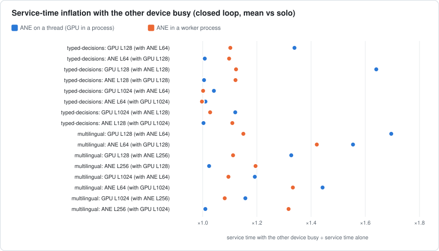
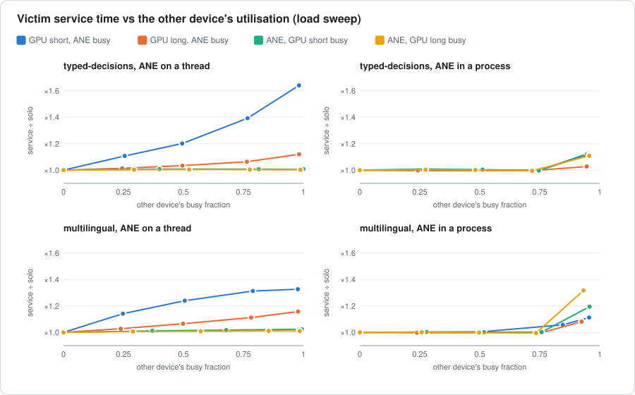
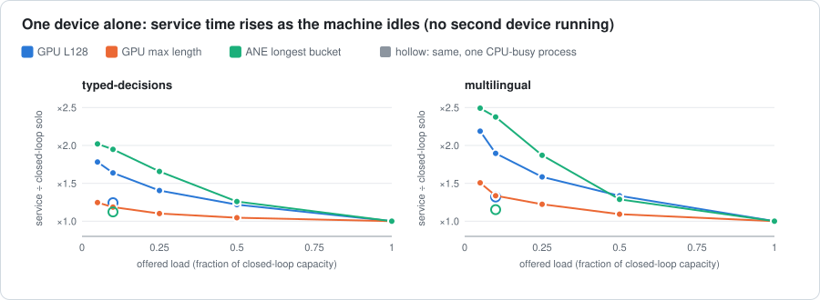
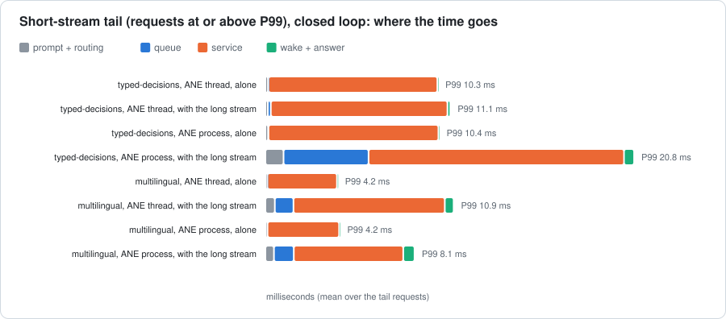
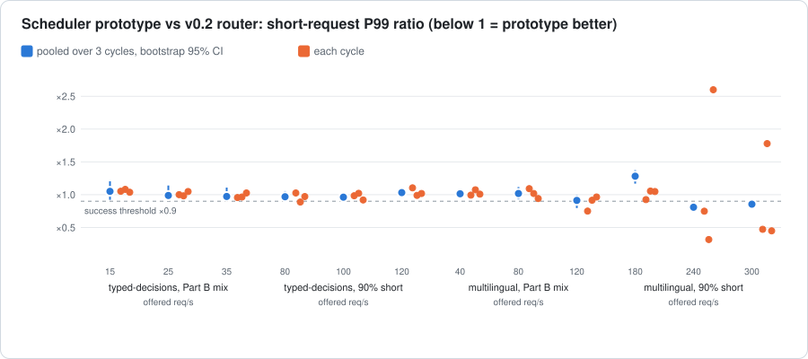

# GPU–ANE interference and tail-latency isolation (issue #16)

**Question.** When one Apple-silicon machine serves independent Laya requests on the MLX GPU and
the Neural Engine at the same time, heterogeneous serving raises aggregate throughput. Why do
the short and long streams' P99 latencies still rise above their solo values
(`benchmarks/v0.2.md`, Part A; README "Isolation is partial")? And what would a scheduler need
to model to predict completion times under that interference?

Everything here is research code. `laya_apple` is unchanged. The tracing wraps the product's
own `DeviceWorker` and backends from the outside and only reads the clock (see
[Instrumentation](#instrumentation)).

**Status [Measured].** One machine: Apple M4 Max, macOS 26.6.2 (25G83), Python 3.12.14,
MLX 0.32.2, coremltools 9.0, laya-apple 1.0.2. Models: `laya-typed-decisions`
(ModernBERT-large) and `laya-multilingual` (mmBERT-base). About 1.49 million traced
requests. 0 answer mismatches in every cell.

## Answers

| Question | Answer |
|---|---|
| Q1. Does service time itself slow down under GPU+ANE concurrency? | **Yes, but device execution barely changes.** The FIFO-visible service time rises by up to ×1.70 (GPU) and ×1.56 (ANE). Inside it, MLX `mx.eval` time rises by at most ×1.04 in 15 of the 16 GPU matrix streams (×1.11 in one). The rise is host-side, and its mechanism depends on where the ANE runs (Q2). |
| Q2. How much does each device slow the other? Is it asymmetric? | **Strongly asymmetric, and the asymmetry flips with placement.** *ANE on a thread:* the GPU pays, ×1.04–1.64 for typed-decisions and ×1.16–1.70 for multilingual. That is the time the parent's GPU dispatcher thread waits for the GIL while Core ML `predict` holds it. The ANE is unaffected (≤×1.024), except multilingual's L64 bucket (×1.44–1.56). *ANE in a process:* both pay, the ANE ×1.00–1.42 and the GPU ×1.00–1.15. The executing process's CPU time for the same work rises 2–4×. |
| Q3. Where does the P99 degradation come from? | **Closed loop (the v0.2 Part A numbers): service-time inflation, not queueing.** Mean queue delay stays ≤0.31 ms, and service is 69–96% of the tail requests' time. Most of the rest is prompt building slowed by the GIL. This study reproduces all eight v0.2 Part A P99 deltas within 10 points. **Open loop: queueing** (the tail requests' mean queue delay is 60–250 ms against 17–54 ms of service). Service inflation feeds it. Measurement artifacts were checked and ruled out (Threats to validity). |
| Q4. Is interference systematically related to shape and load? | **Yes.** *Thread placement:* an **additive** delay, the same few ms for a short and a long GPU request, growing roughly linearly with the ANE's busy fraction. It is up to +7.9 ms at full ANE load for typed-decisions and scales with the length of the ANE call. *Process placement:* **a threshold near saturation.** There is no change (±1%) up to 75% utilisation of the other device, then 0% to +42% once it is saturated, bimodal between cycles. Independently, **service time rises as load falls**: one device alone at 5–10% of its capacity serves ×1.6–2.5 slower than when busy. This is a CPU (and, for the GPU, device) power-state effect, not interference. |
| Q5. When does backlog + static service estimate route wrongly? | **Its estimates are often wrong, but its decisions rarely are.** The static estimates (closed-loop P50s) under-predict GPU service by up to 8 ms per request while a thread-placed ANE is busy. They under-predict both devices by ×1.6–2.5 at low load and by ×1.1–1.4 near saturation in the process placement. Those errors matter only where `decide_queued` compares the two devices. The GPU served 0.4–5% of the short requests in the product workloads. In hindsight, 0–7% of the short requests kept on a busy ANE and 0–20% of those diverted to the GPU (22–128 per run) were misses, with a mean cost of 2–8.5 ms. The short class's P99 is set by requests the ANE served, and every other class can only run on the GPU. |
| Q6. What minimal model should the next scheduler use? | For **completion-time prediction**, fitted per machine from the matrix, `s' = s·(1 + a) + d` while the other device is busy. The thread placement comes out additive: a≈0, d = the GIL wait (7.7 ms for typed-decisions' GPU). The process placement comes out mostly proportional (a up to 0.61, d ≤1.4 ms). Low load needs its own term. A **prototype using that model was A/B-tested against the v0.2 router and failed the success criteria written before the run**: no workload improved the short P99 reliably, and near saturation the result flipped from cycle to cycle ([Scheduler prototype](#scheduler-prototype)). **No contention-aware routing change is proposed.** The levers the data points to are execution (the GIL hold, the CPU power state), not routing. |

## Motivation

`benchmarks/v0.2.md` Part A measured each stream's P99 above its solo value in every
configuration. Examples: typed-decisions, ANE on a thread, short +8% and long +13%;
multilingual +153% (thread) / +99% (process). The ordering even reversed between models:
typed-decisions was worse in the process placement (+91%). `research/v0.2-concurrency/`
had narrowed this down to host-side effects (the GIL for two backends in one interpreter, a
4–6× slower IPC-driven host thread). But nothing split one request's latency into queueing,
service and overhead, and nothing separated the two devices' effect on each other. Issue #16
asks for that, and for thread vs. process placement to be explained.

## Methodology

### Instrumentation

`scripts/jobtrace.py` records, per request, from one system-wide monotonic clock
(`time.perf_counter` = `mach_absolute_time()` on macOS, identical in the caller and in worker
processes):

| Timestamp | Where |
|---|---|
| `arrival` | the client decides to issue the request (open loop: the scheduled Poisson arrival) |
| `queue_enter` | `DeviceWorker.submit`: the request enters the device's FIFO |
| `device_start` / `device_end` | `DeviceWorker._run` entry and exit: the device's FIFO is occupied |
| `response` | the caller holds the formatted answer (open loop: the Future resolved) |

Derived: `pre` = queue_enter − arrival (prompt build, eligibility check, routing),
`queue` = device_start − queue_enter, **`service`** = device_end − device_start (what the
scheduler's service estimate predicts), `post`, and **`e2e`** = response − arrival.

Inside each backend call, `jobtrace.install_phase_hooks` splits `forward` into **device
execution** (`mx.eval` for MLX, Core ML `predict` for the ANE) and **host** work (NumPy
features, the FP32 action head, MLX graph construction). It also records the thread's CPU
time. The same hooks run in worker processes through `scripts/hooks/sitecustomize.py`, only
when `LAYA_TRACE_DIR` is set. `service − forward` is the **dispatch** cost: the IPC round trip
for a process-placed device, 0 for a thread-placed one. The wrappers are instance-level,
return the wrapped call's result unchanged and add about 1 µs per timestamp. Solo service
times here match the v1.0 forward P50s within 0.1 ms (typed-decisions ANE L128: 9.95 vs
9.91 ms; GPU L1024: 71.10 vs 71.03 ms).

### Workload and correctness

- Exact-length requests from `laya_apple.workload` (8 seeds per shape, cycled). The shapes per model:

  | | ANE short `S` | GPU short `M` | ANE long `B` | GPU long `L` |
  |---|---|---|---|---|
  | typed-decisions | L64 | L128 | L128 (largest bucket) | L1024 |
  | multilingual | L64 | L128 | L256 (largest bucket, the tie band) | L1024 |

- **Every answer** is compared with the inline answer for the same request on the same device
  (`Laya(device="gpu"|"ane")`).
- Every ANE request passes the product's own eligibility check (`ANEShapes.check`) before it
  is queued.
- Every run loads the ANE through the product path: validated artifacts plus the load-time
  placement probe (`probes` are recorded in each raw file). A run whose ANE path is unavailable
  aborts rather than measuring a fallback.

### Windows and statistics

- 25 s measurement windows after a 2 s warm-up, 3 cycles, cell order reversed on odd cycles,
  2 s settle.
- Only requests that **arrive** inside the window count, and every stream keeps running for a
  400 ms guard after it, so every measured request ran with its aggressor active.
- Pooled statistics over the cycles, with bootstrap 95% CIs (1000 resamples).
- A P99 with fewer than 10 samples above it is flagged `p99_reliable: false` in `results.json`.
  All matrix, solo and product-closed cells have n ≥ 925. A few sparse GPU-long cells have
  n = 48–93 and are reported by their mean only.
- Background: AC power, no thermal or performance warning in any window (`pmset -g therm`
  before each window, in the raw data). The local LLM service was stopped for the whole study;
  a desktop wallpaper extension (~5–10% of one core) kept running.

### Experimental matrix

| Plan | Cells | Per model × ANE placement |
|---|---|---|
| `device` (streams feed one device's `DeviceWorker` directly; the experimenter picks the device) | **solo** ×4 shapes; **matrix** GPU {M, L} × ANE {S, B}, both closed loop; **sweep** closed-loop victim vs open-loop Poisson aggressor at 25/50/75% of its solo capacity, 4 victim/aggressor pairs; **control** victim + {4 CPU-burning processes, a ~140 GB/s memory-copy process, a pure-Python thread in the caller} | 2 models × {thread, process} |
| `product` (requests through `Laya.submit`; the v0.2 router decides) | v0.2 **Part A** (solo short, solo long, hetero, closed loop); v0.2 **Part B** class mix (60% short / 20% medium / 10% long / 10% short 4-question), Poisson at 3 rates | 2 models × {thread, process} |
| `device --parts sparse` | one device alone, Poisson at 5/10/25/50% of capacity; plus 10% with one CPU-burning process | typed-decisions (thread), multilingual (process): the shipped placements |
| `product --scheduler both` | the Part B mix and a 90% short / 10% long mix at 3 rates each, **v0.2 `decide_queued` and the contention-aware prototype interleaved** on identical arrivals | the shipped placements |
| `gil_probe.py` | another Python thread's progress and wake-up latency while a Core ML `predict`, an ANE `forward` or an MLX `forward` runs in a loop | both models |

## Results

Full tables, generated from `results.json`: [tables.md](tables.md). Every number below is in it.

### Solo baselines

Closed-loop solo service is tight: P99 within 2% of P50 in every cell. Examples:
- typed-decisions: ANE L128 9.95 ms (P99 10.10); GPU L128 12.28 ms; GPU L1024 71.10 ms.
- multilingual: ANE L64 3.39 ms; GPU L1024 29.29 ms.

### Concurrent matrix: service-time inflation



Mean service time with the other device running closed loop, against solo (95% CIs are
within ±0.01 of the ratio):

| Cell (typed-decisions) | ANE on a thread: GPU | ANE | ANE in a process: GPU | ANE |
|---|---:|---:|---:|---:|
| GPU L128 + ANE L64 | ×1.339 | ×1.008 | ×1.102 | ×1.097 |
| GPU L128 + ANE L128 | ×1.641 | ×1.005 | ×1.123 | ×1.121 |
| GPU L1024 + ANE L64 | ×1.041 | ×1.010 | ×1.001 | ×0.997 |
| GPU L1024 + ANE L128 | ×1.120 | ×1.003 | ×1.027 | ×1.109 |

| Cell (multilingual) | ANE on a thread: GPU | ANE | ANE in a process: GPU | ANE |
|---|---:|---:|---:|---:|
| GPU L128 + ANE L64 | ×1.696 | ×1.555 | ×1.150 | ×1.421 |
| GPU L128 + ANE L256 | ×1.327 | ×1.024 | ×1.112 | ×1.195 |
| GPU L1024 + ANE L64 | ×1.192 | ×1.442 | ×1.095 | ×1.333 |
| GPU L1024 + ANE L256 | ×1.157 | ×1.010 | ×1.081 | ×1.317 |

Where the added time goes (tables.md, "Concurrent matrix"):

- **ANE on a thread.**
  - Typed-decisions: the GPU's added time is almost entirely **dispatch**, the parent side of
    the IPC round trip: +3.7, +7.4, +2.4 and +8.0 ms for the four cells. Meanwhile the GPU's
    forward in its worker changes by ≤×1.038 and `mx.eval` by ≤×1.037. The GPU is not
    slower; the parent's GPU dispatcher thread is late to send and to collect.
  - Multilingual: the same dispatch delay (+2.1 to +4.3 ms). In the two cells with the L64 ANE
    stream (about 290 calls/s), the GPU worker's own CPU time also rises (+2.9 to +5.5 ms per
    request).
  - That same L64 stream is the one ANE stream the GPU slows in the thread placement
    (×1.44–1.56, Core ML `predict` ×1.21–1.44). Why only at L64 is not established
    [Hypothesis: the CPU performance state again, at the highest call rate].
- **ANE in a process.** Dispatch changes by ≤0.3 ms. The added time is inside each
  worker's forward, and the worker thread's **CPU time for the same work** rises (typed GPU
  L128: 1.51 → 4.8 ms per request; ANE L128: 0.56 → 1.6 ms). The same code runs on a slower
  CPU performance level, as `research/v0.2-concurrency` found for request-driven workers.
  Core ML `predict`, which includes host-side runtime work, rises by up to ×1.34.
- **Throughput.** Each stream's loss against solo is its req/s ratio in tables.md. For
  example, with the ANE on a thread, typed-decisions GPU L1024 runs at 12.4 vs 13.9 req/s
  solo while the ANE keeps 99% of its solo rate.

### Host-side controls

| Aggressor (no second device) | GPU L1024 service | ANE longest bucket service |
|---|---:|---:|
| 4 CPU-burning processes | ×0.986–0.992 | ×0.997–1.023 |
| Memory-copy process, 139–143 GB/s | ×1.004–1.005 | ×1.001–1.026 |
| Pure-Python thread in the caller | ×1.12–1.30 (dispatch +8.6–8.9 ms) | ×1.98–2.28 (process), **×9.5–12.4 (thread)** |

Other processes' CPU load and CPU-side memory bandwidth do not reproduce the effect. Python
work in the caller's interpreter does, through the same dispatch path as the ANE thread.

### GIL probe

`raw/gil-probe-*.json`. A second Python thread that sleeps 1 ms wakes, on median:
- **0.51 ms late** when idle, and the same during an MLX `forward` loop: MLX releases the GIL
  while it evaluates;
- **8.48 ms late** during a typed-decisions Core ML `predict` loop (the call takes ~9.7 ms):
  `predict` does not let another thread of the interpreter run for the length of the call;
- **3.31 ms late** during a multilingual ANE `forward` loop (the call length).

In a tight loop of multilingual `predict` calls (~3 ms each), the other thread was starved
almost completely: one wake-up in 30–220 s, a counting loop at 0.1% of its idle rate.
Exactly how coremltools hands the GIL back is not established here [Hypothesis]. The
observable effect is.

### Load sweep



- **ANE on a thread: GPU victim, roughly linear in the ANE's busy fraction.**
  - typed-decisions GPU L128: ×1.108 / 1.202 / 1.393 / 1.641 at 25 / 49 / 77 / 98% ANE busy
    (+1.3, +2.5, +4.8, +7.9 ms).
  - typed-decisions GPU L1024: +1.0, +2.4, +4.5, +8.5 ms. Nearly the **same milliseconds**
    for a request 6× longer: an **additive** cost per GPU request, not a proportional one.
  - multilingual: GPU L1024 +0.8 … +4.6 ms; GPU L128 +0.9 … +2.1 ms (saturating).
  - The ANE victim stays within ×1.024 at every level.
- **ANE in a process: a threshold.** Every victim stays within ±1% up to 75% of the other
  device's capacity, then rises ×1.03–1.32 at 92–96%. Near saturation the state is bimodal:
  typed-decisions GPU L1024 + ANE L128 ran with the ANE at 9.9 ms in one cycle and 12.3 ms in
  another, and GPU L1024 + ANE L64 showed no inflation at all.

### Sparse load (no second device)



One device alone, open loop, against its closed-loop solo service:

| | 5% load | 10% | 25% | 50% | 10% + one CPU-busy process |
|---|---:|---:|---:|---:|---:|
| typed-decisions ANE L128 | ×2.02 | ×1.95 | ×1.66 | ×1.26 | ×1.12 |
| typed-decisions GPU L128 | ×1.78 | ×1.64 | ×1.40 | ×1.22 | ×1.24 |
| multilingual ANE L256 | ×2.49 | ×2.38 | ×1.87 | ×1.29 | ×1.15 |
| multilingual GPU L128 | ×2.19 | ×1.90 | ×1.59 | ×1.34 | ×1.32 |

At 5–10% load the executing thread's CPU time for the same work is ×5.4–7.4. One unrelated
CPU-busy process brings it back to ×1.07–1.15 and the ANE's service to ×1.12–1.15. The GPU
keeps ×1.24–1.32 even then, and its `mx.eval` time is up by the same factor. So an idle
machine serves a request slower, through the CPU's performance state (both devices) and, for
the GPU, the device's own. **This is the largest service-time change in the study.** It runs
the opposite way to interference, and the static routing estimates (closed-loop P50s) do not
see it.

## Tail-latency analysis



**Closed loop (the v0.2 Part A mix, through `Laya.submit`).**

| | short P99 Δ (v0.2) | long P99 Δ (v0.2) | queue mean | tail: service share |
|---|---:|---:|---:|---:|
| typed-decisions, thread | +8% (+8%) | +13% (+13%) | ≤0.10 ms | 96% / 96% |
| typed-decisions, process | +100% (+91%) | +16% (+15%) | ≤0.31 ms | 69% / 90% |
| multilingual, thread | +163% (+153%) | +39% (+38%) | ≤0.18 ms | 80% / 88% |
| multilingual, process | +93% (+99%) | +21% (+21%) | ≤0.22 ms | 73% / 90% |

"Tail: service share" is the mean service time of the requests at or above P99, over their
mean e2e. The remainder is mostly `pre`: prompt building on the client thread, itself slowed
by the GIL (typed process long: 6.6 ms). With one client per stream there is no queue to
speak of, so the v0.2 deltas are service-time inflation of the host-side kinds above. The
typed-decisions ordering (thread +8%, process +100%) and the multilingual one (thread worse)
follow from the matrix:
- a thread-placed typed-decisions ANE is untouched by the GPU;
- a process-placed one slows ×1.10–1.12;
- the multilingual ANE, at about 4 ms per call, is slowed by the GPU in either placement.

**Open loop (Part B mix).**
- The P99 of every class is dominated by **queueing**. The tail requests' mean queue delay
  is 60–250 ms against 17–54 ms of service.
- The medium, long and 4-question classes run only on the GPU.
- The short class's tail requests are ANE requests queued behind other ANE requests.
- Service inflation (interference at high load, power state at low load) sets how fast those
  queues drain.

## Hypotheses

| # | Hypothesis | Expected signal if true | Distinguishing experiment | Result | Conclusion |
|---|---|---|---|---|---|
| 1 | Shared-memory bandwidth contention | device execution (`mx.eval`, `predict`) slows; a bandwidth aggressor reproduces it | device-exec split in the matrix; 140 GB/s memory-copy control | GPU `mx.eval` ≤×1.04 in 15 of 16 matrix streams (×1.11 once); memory copy ≤×1.026; thread-placed typed ANE `predict` unchanged | **Not supported as the dominant cause.** A residual ≤4% on GPU execution is not excluded (no fabric counters without root) |
| 2 | CPU scheduling / executor contention (other work on the cores) | a CPU-burning aggressor reproduces it | 4 CPU-burning processes | ≤×1.023 | **Not supported as the dominant cause.** Instead, the evidence points to the *CPU performance state*: per-request CPU time ×2–4 in process placement under load, ×5–7 at low load, removed by keeping one core busy. No direct P-state measurement without root [Hypothesis] |
| 3 | Python GIL | the thread-placed ANE delays parent-side Python (dispatch), not the GPU itself | dispatch vs forward split; pure-Python-thread control; GIL probe | GPU dispatch +2.4–8.0 ms with forward ≤×1.04; the control reproduces it (+8.6–8.9 ms); `predict` blocks other threads for the whole call | **Confirmed** for the thread placement: the source of GPU inflation there |
| 4 | Core ML runtime synchronisation | ANE `predict` slows, or blocks the GPU, independently of the GIL | thread vs process placement; `predict` span | thread-placed typed `predict` ×0.99–1.00 with the GPU busy; the process-placed rise tracks CPU time | **No evidence** of device-level Core ML/MLX synchronisation. The only Core ML effect found is its GIL hold (#3) |
| 5 | MLX runtime synchronisation | MLX holds the GIL or `mx.eval` slows | GIL probe; `mx.eval` span | MLX forward: another thread wakes on time (0.51 ms); `mx.eval` ≤×1.04 (thread) | **Rejected** |
| 6 | Thread-based ANE effects | GPU pays, ANE doesn't | matrix, thread placement | GPU ×1.04–1.70, ANE ≤×1.024 (except multilingual L64, ×1.44–1.56) | **Confirmed**; mechanism #3. The L64 exception is unexplained |
| 7 | Process-based ANE effects | IPC cost, or host slowdown in workers | dispatch vs forward and CPU-time split | dispatch ≤0.3 ms; CPU time ×2–4; threshold at saturation, bimodal | **Confirmed** as host CPU slowdown, not IPC; exact OS policy not observable without root [Hypothesis] |
| 8 | Request queueing | tail requests' time is queue delay | queue/service decomposition of the tail | closed loop: queue ≤0.31 ms mean, tail ≥69% service; open loop: tail 60–250 ms queue | **Rejected** for v0.2 Part A; **confirmed** for open loop |
| 9 | Measurement / synchronisation artifact | effects vanish without the harness, or come from timing | solo vs v1.0 forward; Part A vs v0.2 (no tracing); open-loop aggressor vs closed; one clock | solo within 0.1 ms of v1.0; all eight Part A deltas reproduce v0.2; sweep effects appear with open-loop aggressors too | **Rejected** |

## Scheduler prototype

`scripts/contention.py`, research only. It changes the numbers `decide_queued` compares,
never its eligibility logic, which runs first and is unchanged:

- While the other device is busy, the service estimate becomes `s·(1 + a) + d`, fitted per
  model and placement from this study's matrix cells.
- Typed-decisions (thread): GPU a = 0.012, d = 7.72 ms; ANE a = 0, d = 0.06 ms.
- Multilingual (process): GPU a = 0.073, d = 0.26 ms; ANE a = 0.306, d = 0.09 ms.

**Success criteria, written before the A/B ran** (`analyze.py`, `AB_CRITERIA`):
- the short class's P99 at least 10% lower, with the bootstrap 95% CI of the P99 ratio below
  1.0, in at least 2 of a workload's 3 load levels;
- aggregate completed throughput within 2%;
- no other class's P99 more than 10% worse with its CI above 1.0;
- 0 mismatches.

The two schedulers ran interleaved in the same process on identical arrival sequences.



**Result: the prototype fails the criteria in all four workloads.** Full per-class tables are in
tables.md, "Scheduler prototype A/B".

| Workload (shipped placement) | short P99 base → prototype, per load level | levels improved | other-class regressions | throughput | mismatches |
|---|---|---:|---:|---|---:|
| typed-decisions, Part B mix, 15 / 25 / 35 req/s | 38.4 → 40.4, 41.8 → 41.3, 40.0 → 39.0 ms (all CIs include 1) | 0 of 3 | 0 | identical | 0 |
| typed-decisions, 90% short, 80 / 100 / 120 req/s | 70.4 → 68.2, 101.4 → 97.6, 1070 → 1104 ms | 0 of 3 | 0 | identical | 0 |
| multilingual, Part B mix, 40 / 80 / 120 req/s | 22.0 → 22.3, 26.1 → 26.6, 25.4 → 23.2 ms | 0 of 3 | 0 | identical | 0 |
| multilingual, 90% short, 180 / 240 / 300 req/s | 55.0 → **70.5** (×1.28), 261 → **211** (×0.81), 2523 → 2158 (×0.86; long ×1.18) | 2 of 3 | 1 | identical | 0 |

Why the prototype did not help:

1. **It changes almost no decisions.**
   - With a thread-placed typed-decisions ANE, the GIL term (+7.7 ms) removes or trims the few
     diversions to the GPU (GPU share of short requests: Part B mix 2.4–4.3% → 0%; 90%-short
     mix 5.1–8.9% → 4.9–6.2%). But those requests
     were not the tail, and the P99 of the short class does not move.
   - With the process placement, the fitted factors hardly change the comparison (GPU share at
     240 req/s: 10.7% → 10.4%).
2. **The one apparent win is noise.** At 240 req/s (multilingual, 90% short, near
   saturation), the short P99 per cycle was:
   - baseline 246 / 290 / **39** ms;
   - prototype 184 / 92 / **227** ms.

   The winner flips between cycles while the routing mix is the same. The pooled bootstrap CI
   (0.80–0.82) is far too narrow because it treats queued requests as independent. The same
   regime gives a significant-looking *loss* at 180 req/s. The effect is the bimodal
   near-saturation state of the process placement, not the scheduler.
3. **The tails are where routing has no choice.** The short class's tail requests are ANE
   requests queued behind other ANE requests, and every other class runs only on the GPU.

## Threats to validity

- **One machine, one OS build.** Every parameter here is from an M4 Max on macOS 26.6.2. The
  GIL mechanism is a property of coremltools' Python binding and should carry over. The CPU
  power-state effects and the process-placement threshold depend on the OS's performance
  controller and the SoC, so they must be re-measured per machine.
- **Autocorrelation.** Closed-loop requests are not independent, so the bootstrap CIs
  (which assume they are) are too narrow. The per-cycle spread in `results.json`
  (`cycle_range`) is the more honest error bar. For the process-placement matrix it is large
  (the bimodal state).
- **Harness Python in the caller.** Client threads build prompts and format answers in the
  same interpreter, as a real server's would. With a thread-placed ANE their GIL demand is
  part of what is measured, and a server doing more Python per request will see more.
- **Routing hindsight is an approximation.** It uses the other device's observed FIFO state
  and its median service for the class in the same window, and ignores knock-on effects on
  later requests. The prototype A/B measures the real thing.
- **Recorded commit.** The eight main runs record `main` (8140f38) as their commit, because
  the harness was committed after they ran. The harness they ran is this branch's first
  commit. Later changes only added the sparse and scheduler cells.
- **Compact raw data.** `raw/` (17 MB) holds every request at 10 µs resolution, with the
  backend phase split joined in. The full traces (78 MB) are not committed. `analyze.py` gives the
  same inflation ratios from either form (largest difference 0.0002).

## Scheduler implications

1. **No contention-aware routing change.** The v0.2 rule's decisions are rarely wrong in
   hindsight. The tails live where routing has no choice. The calibrated prototype changed
   almost nothing, and nothing reproducibly (Scheduler prototype). This is the negative result
   that stops a "contention-aware scheduler" PR.
2. **Isolation is an execution problem.**
   - **Thread placement:** every ANE call holds the caller's GIL for its whole duration. The
     GPU dispatcher, and any Python in the application, wait behind it. That costs up to
     ~8 ms per GPU request (typed-decisions) and up to ×12 per ANE call when the application
     runs Python concurrently.
   - **Process placement:** removes that, at the price of a CPU slowdown in both workers
     under sustained two-device load.
   - **Next step:** make the GIL hand-off explicit (release the GIL around `predict`, or
     move feature building and `predict` out of the interpreter). That is the change most
     likely to shrink the thread placement's GPU penalty. It needs its own measurements
     before it touches placement.
3. **Power state matters more than contention at low load.** A ×1.6–2.5 slower first request
   on an idle machine is a latency floor any SLO-aware policy has to account for. It is
   also a correction the static routing table cannot express. It is not a routing-threshold
   change: that would need its own PR and measurements (AGENTS.md).
4. **If a completion-time model is ever needed** (admission control, SLO reporting), it must
   come from local calibration (`laya-apple calibrate`), never from constants:
   - `s·(1 + a) + d` per device while the other is busy, fitted from a matrix like this one;
   - a load term for the idle-machine slowdown.

## Reproducing

```bash
export LAYA_APPLE_CACHE=/path/to/cache HF_HUB_OFFLINE=1   # built, validated ANE artifacts
# the full campaign (~5 h on an M4 Max; idle machine, AC power): device, product, sparse plans
sh research/gpu-ane-interference/scripts/run_all.sh
# GIL probe
uv run python research/gpu-ane-interference/scripts/gil_probe.py --model laya-typed-decisions \
    --seconds 6 --out research/gpu-ane-interference/raw/gil-probe-laya-typed-decisions.json
# scheduler prototype A/B (needs results.json for calibration)
uv run python research/gpu-ane-interference/scripts/interference.py --model laya-typed-decisions \
    --ane-placement thread --plan product --only-open --scheduler both --rates 15 25 35 \
    --heavy-rates 80 100 120 --out FULL/sched-laya-typed-decisions-thread.json.gz
# full traces -> committed compact form -> results, tables, figures
uv run python research/gpu-ane-interference/scripts/compact.py FULL/*.json.gz --out-dir research/gpu-ane-interference/raw
uv run python research/gpu-ane-interference/scripts/analyze.py
uv run python research/gpu-ane-interference/scripts/report.py > research/gpu-ane-interference/tables.md
uv run python research/gpu-ane-interference/scripts/figures.py
```

`analyze.py --check` and `figures.py --check` fail when `results.json` or a figure is stale.

## Files

| Path | What |
|---|---|
| `scripts/jobtrace.py`, `scripts/hooks/sitecustomize.py` | the instrumentation |
| `scripts/interference.py` | the measurement driver (device, product, sparse and A/B plans) |
| `scripts/gil_probe.py` | the GIL probe |
| `scripts/contention.py` | the scheduler prototype (research only, calibrated from `results.json`) |
| `scripts/compact.py`, `scripts/analyze.py`, `scripts/report.py`, `scripts/figures.py` | raw → results → tables → figures |
| `raw/*.json.gz` | every request of every window (compact form), with environment, windows and conditions |
| `raw/gil-probe-*.json` | GIL probe results |
| `results.json` | every derived number |
| `tables.md`, `figures/` | generated |
